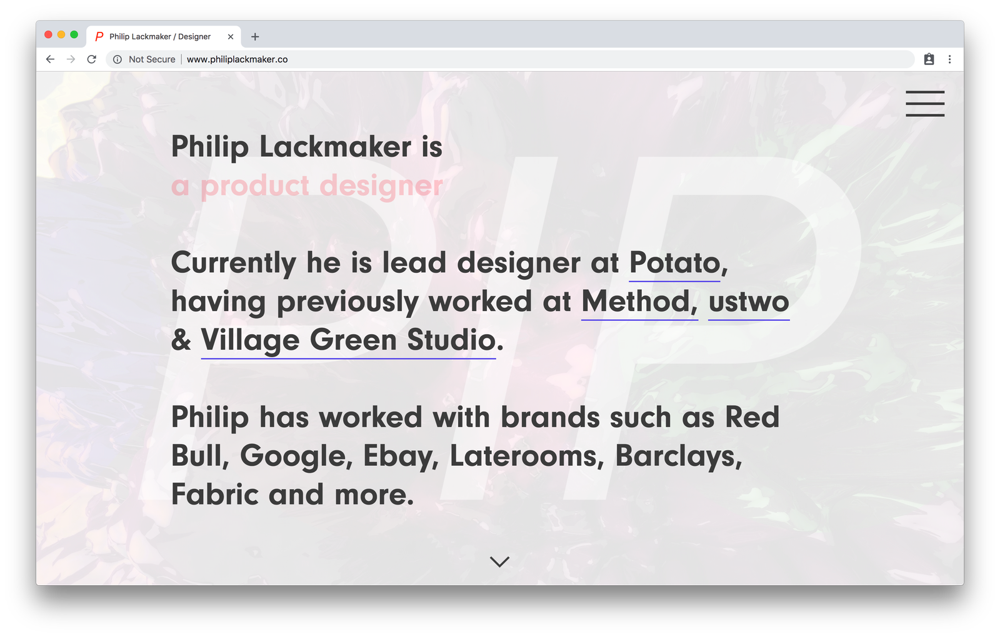
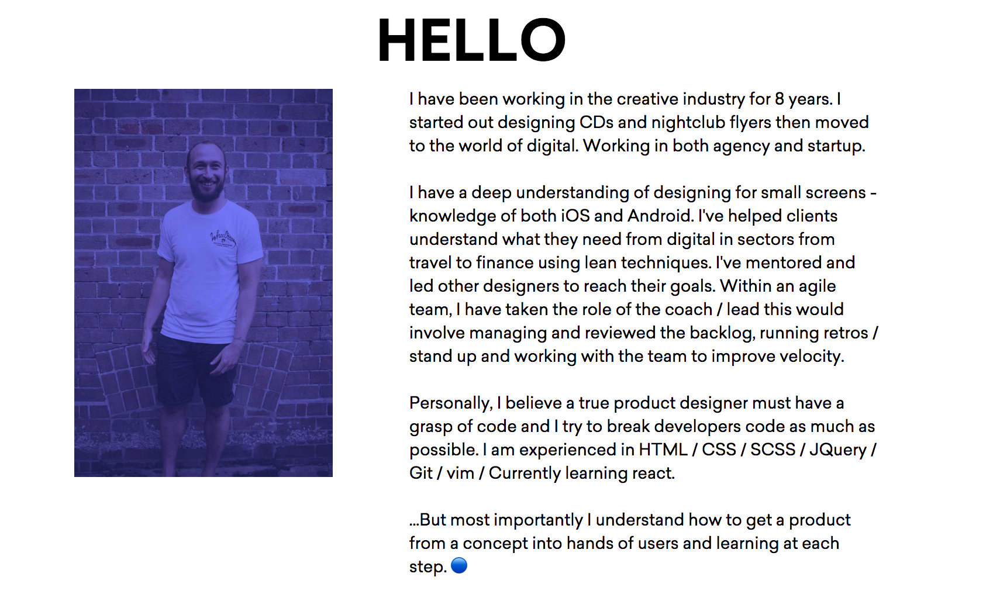
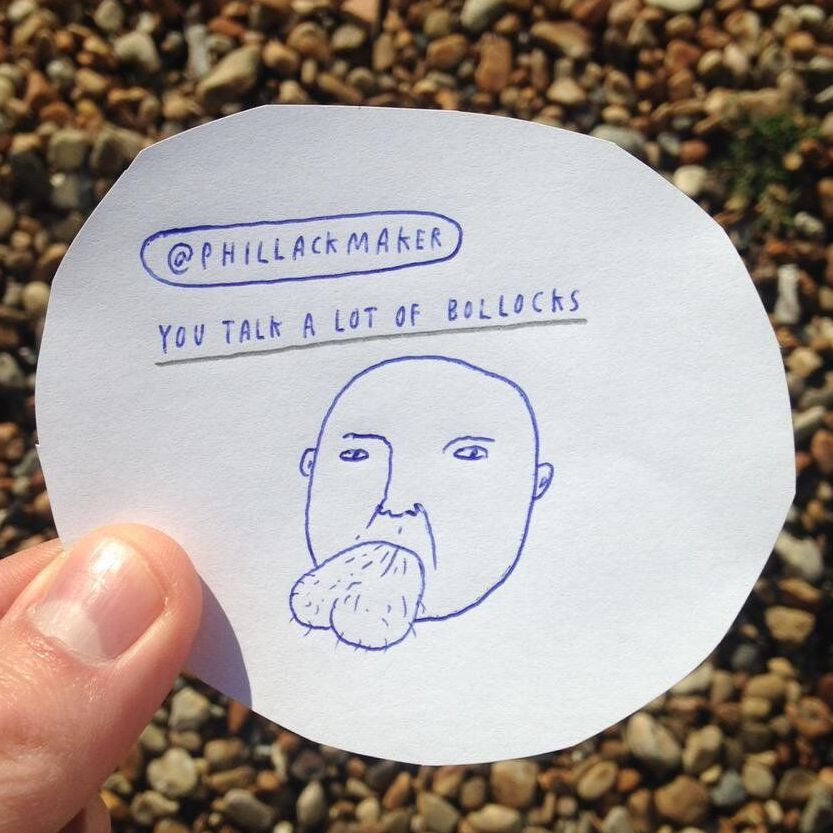

👋🏻 Weclome to my new blog and site 👋🏻
<br><br>
This is the first blog I have had running on my site and this is the first proper. I wanted to start the blog with writing about building this site but if you search for ‘Building your Gatsby site’, there are loads of blog posts written by proper developers about how they did it so if you want to learn more of the process.
<br><br>
**I recommend these resources which helped me as this post will probably not help you solve a GraphQL problem.**
<br><br>

- [Gatsby.org](https://www.gatsbyjs.org) site is great and has loads of really good [tutorials](https://www.gatsbyjs.org/tutorial/) on how to start building a site with Gatsby.
- [LevelUp Tutorials](https://www.youtube.com/watch?v=b2H7fWhQcdE) was the main resource for me to understand Gatsby they are great and really easy to follow
- I found this [post](https://codebushi.com/using-gatsby-image-version1/) really useful to understand how to get images to work
  <br><br>

3 years ago I could not code but working closely with developers at ustwo I started to understand the principles of development, this made me want to learn. The way I understood development was doing a General Assembly HTML/CSS course this really helped me grasp development.
<br><br>
Now with this mountain of knowledge and the fact, my personal website was non-existent I built my first portfolio site from scratch. Let’s say my first site was basic but it worked. [You can read more about it on my Medium post](https://medium.com/@phillackmaker/2015-resolution-3eafe76044c2)
<br><br>

<br><br>
The problem with this site was it was a pain to make changes to. The site was hard-coded so if I wanted to make a change I would have to do it on every page nothing was built programmatically. It did its job but it was time for it to retire the site.
<br><br>
Fast forward to today well actually about 4 months ago I decided to embark on building a new site. There were some driving factors to this; some new projects that I want to show, I want to focus more on the process and learnings and less on the visual output and finally, I wanted to challenge my technical understanding.
<br><br>
My first step was to whip up a design I wanted to create a lean system as I know I tweak and change it within the browser. The design system was simple 3 colors, two typefaces (Saliec and GT-Super) and the 'doodle design element'.
<br><br>

<br><br>
The next step was to decide on what tech stack to use and this is when I stumbled upon [😍Gatsby😍](https://www.gatsbyjs.org). In a nutshell Gatsby builds your website from your data source (markdown, CMS etc) and using a bunch of cool features to make your life easier it builds the site for you built on the React. I had a basic understanding of react and this project allowed me to take it my understanding further.
<br><br>
Gatsby allows you to host and deploy on whatever platform you want. I used [Netlify](https://www.netlify.com/) to do the deployment; Netlify then connects to a Github repo so when you push to master (or whatever you repo is) it triggers a deployment to the live site. Netlify also has a bunch of cool features that means that you don’t need to actually programme (my favourite way to do development). The [Contact us form](/about) is powered by Netlify so I did not have to do any logic or backend to store the user's details.
<br><br>

<br><br>
The next part is [GraphQL](https://graphql.org/) 🤓 which has been the hardest part to get my head around. If you want to use information from your data source and use it on your site you need to run queries on that data to pull it on the page. GraphQL lets you run these queries in real-time and also allows you to apply API’s to effect that data.
<br><br>
This is an example of GraphQL query I am running on the [about page](/about).
<br><br>

```graphql
query AboutByPath($id: String!) {
  markdownRemark(id: { eq: $id }) {
    html
    frontmatter {
      path
      title
      templateKey
      cover_image {
        childImageSharp {
          fluid(
            maxHeight: 1200
            duotone: { highlight: "#4644FD", shadow: "#222172", opacity: 65 }
          ) {
            ...GatsbyImageSharpFluid
          }
        }
      }
    }
  }
}
```

<br><br>
This is a breakdown of the query, specifically `cover_image`.
<br><br>

```graphql
cover_image {
        childImageSharp {
          fluid(
            maxHeight: 1200
            duotone: { highlight: "#4644FD", shadow: "#222172", opacity: 65 }
          ) {
            ...GatsbyImageSharpFluid
```

<br><br>
In this part of the query, I am pulling `cover_image` from my markdown for the about page. (_Example of the Markdown_ `cover_image: "phil-3.jpg"`).This is just an image file I have declared in the markdown. The next part I am asking the query to use a plugin to run some tasks on that query. I want to scale the image for breakpoints and also place a colour overlay over the image. To do this I want to expose several image processing GraphQL functions built on the Sharp image processing library using the plugin `gatasby-transformer-sharp`. Firstly `Fluid` function which means my image will be resized for breakpoints and within that I run ‘duotone’ which will then apply colouring overlay to the image. If you want to learn more about `gatasby-transformer-sharp` [read this](https://image-processing.gatsbyjs.org/)
<br><br>
**Final result!** The image is now scaled to my different breakpoints and is also coloured.
<br><br>

<br><br>
**My backlog**

- Build the Blog landing page
- Build new functionality on the blog, Social, Comments, Tags
- Re-design the "Approach' page
- Build the presenter mode
- Add Global search to the site
- Write more blog posts

<br><br>

_(Illustration by Mr Bingo but I paid on Kickstarter so do I own it)_
