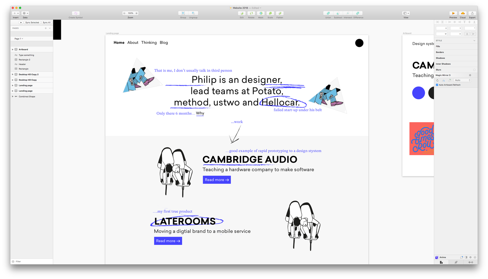
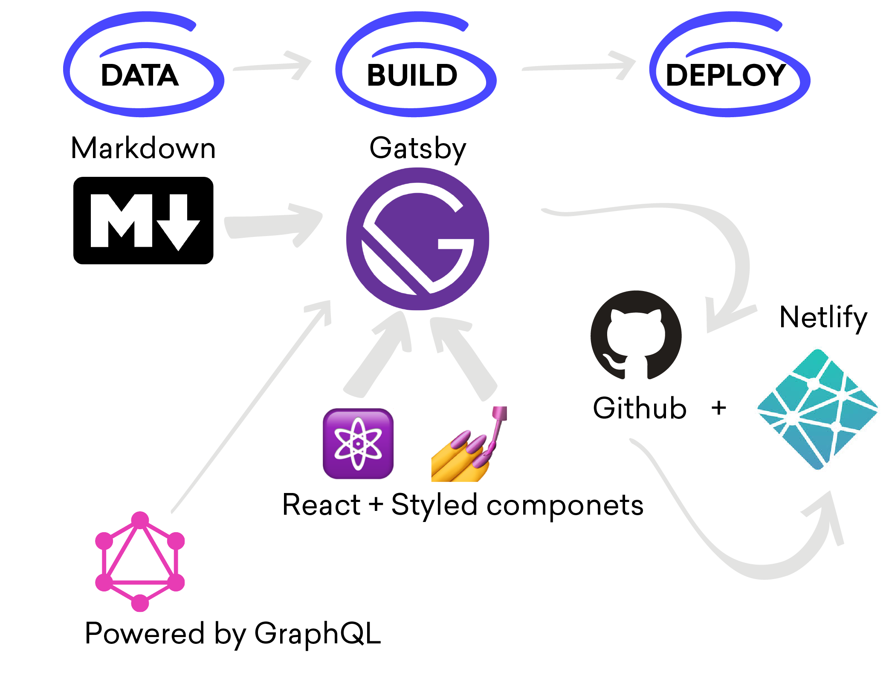

<br><br>
_(Illustration by Mr Bingo but I paid for him to do it so I own it)_
I suck at writing! Now I have that off my chest hopefully you will cut me some slack when you read this post.
<br><br>
This is the first blog I have tried to maintain and this is the first post on this new platform. I wanted to write about building this site but if you google ‘Building your Gatsby site’, there is loads of blog posts written by proper developers about how they did it so if you want to work out how to do it. I recommend these resources which helped me
as this post will probably not help you solve a GraphQL problem.
<br><br>

- The Gatsby.org site is great and has loads of really good tutorials on how to build a site
- LevelUp Tutorials was the main resource for me to understand Gatsby they are great and really easy to follow
- I found this post really useful to understand how to get images to work

(I am going to update this as I find more useful references)
<br><br>
Since about 3 years ago I could not really code but from designing sites and working developers I started to understand more of the principles of how to they build software. My way in to this magical world of development was via General Assembly which really helped me. Whilst living in Australia I did the HTML/CSS course and this really made me understand developers are not really that smart and it is actually easy 🙃 .
<br><br>
Now with this mountain of knowledge and the fact I did not have a personal website I had build my first portfolio
site. Let’s say my first site was basic but it worked I also learnt that if you ask developers how to do something most of the time they will ACTUALLY DO IT FOR YOU (little tip for you). The site was pure HTML/CSS/JQuery but I was shown the wonders of SCSS and frameworks such a bourbon & neat which for my tiny tiny designer brain it made a lots of sense to me. I was blown away you could store variables as colors and change it in one place and it will change everywhere in the site. You can read more about it on my Medium post
<br><br>

<br><br>
The problem with this site was it was a pain to make changes to. Everything was hard coded so if I wanted to make a change I would have to do it on every page. It did its job but it was time for it to retire (it might still be live as I have not moved the new site to my domain)
<br><br>
Fast forward to today well actually about 4 months ago I decided I needed a new site. There was some driving factors to this I had some new projects that I want to show and I want to position myself more as a product designer and less graphic/visual designer; I wanted to go more into the details of the process and the learning than the visual output.
<br><br>
My first step was to whip up a design something I hopefully can do. (It actually looks pretty similar to what I built) Also to create a lean identity something that I will write a blog post on later.
<br><br>

<br><br>
The next step was to decide on what tech stack to use and this is when I stumbled on 😍Gatsby😍. In a nutshell Gatsby builds your website from your data source (markdown, CMS etc) and using a bunch of cool tech to make you life easier it builds the site for you all wh with a underpinning of React.
<br><br>
You then can host and deploy it on what ever platform you want. I use Netlify to do the deployment; Netlify then connects to a Github repo so when you push to master (or what ever you say you repo is) it triggers a deployment to the live site PRO. Netlify also has a bunch of cool features that means that you don’t need to actually programme. Example: Contact us form is powered by Netlify so I did not have to do any javascript to store the information that.
<br><br>

<br><br>
The next part is GraphQL 🤓 This part was the hardest part to get my head around. If you want to use information from your data and use it on your site you need to run queries on that data. GraphQL lets you run queries in realtime and also allows you to use API’s to effect that data.
<br><br>
So this is an example of query I am running on the about page.
<br><br>

```graphql
query AboutByPath($id: String!) {
  markdownRemark(id: { eq: $id }) {
    html
    frontmatter {
      path
      title
      templateKey
      cover_image {
        childImageSharp {
          fluid(
            maxHeight: 1200
            duotone: { highlight: "#4644FD", shadow: "#222172", opacity: 65 }
          ) {
            ...GatsbyImageSharpFluid
          }
        }
      }
    }
  }
}
```

<br><br>
I want to breakdown this query down further specifically `cover_image`.
<br><br>

```graphql
cover_image {
        childImageSharp {
          fluid(
            maxHeight: 1200
            duotone: { highlight: "#4644FD", shadow: "#222172", opacity: 65 }
          ) {
            ...GatsbyImageSharpFluid
```

<br><br>
In this part of the query I am pulling the ‘cover_image’ from my markdown this is just an image file I have declared in the file. I am the asking the query to use an API to run some tasks on the query. I want to run ‘fluid’ which means I will get a bunch of images at all different sizes and I also I want to run ‘duotone’ which will then apply colouring to the image
<br><br>
BOOM! The image is now scaled to my different breakpoints and it is also coloured.
<br><br>

<br><br>
The next steps with this site (you could even call it a backlog)
