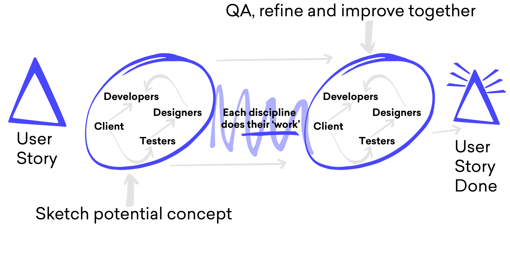

| Expertise             | Platforms     | Deliverables      |
| --------------------- | ------------- | ----------------- |
| Design, & Interaction | iOS & Android | UI, UX & Strategy |

###The Problem

Working as lead product designer at ustwo, I was tasked with redesigning the Laterooms app for both iOS* and Android*. From pitch to product cycle I was responsible for the visual look and feel, user experience and product strategy.
  
We had great success improving the app, taking it from 1 star reviews to a class leading experience.
My involvement on the app stopped at the end of 2014 so latest design decisions are unfortunately out of my hands.

###Redefining the brand for mobile

Even though Laterooms had an existing brand it needed some help and guidance to move them towards a modern experience. I created a series of workshops to work out the new visual brand and how it would transalte to mobile.
  
[For a more in depth understanding of the process](https://www.creativebloq.com/app-design/design-studio-gives-mobile-booking-app-super-powers-21410594)
  

###Creating a playful product

One of the traits that Laterooms wanted was a product that had a level of playfulness in it's personality. So working with the talented Ben Marsh we looked into how we could add this to the visual language. We created some moments of delight (I hate myself for saying that) the icons had a playful tone and we had some rich animations / transitions.
  

###Redesign for Asia

Laterooms owned another brand called Asiarooms (which has now merged into Laterooms) so we were tasked with reworking the product for the Asian market.
  

###Improving the process

At ustwo we always look at the process and how we can improve. Working with Adam Taylor we looked at how we can bring design closer to development within agile. This diagram explains it.
  

###Final product

Even though this projet is relatively old. I am still very proud of what I learnt and how we made this product.
  

