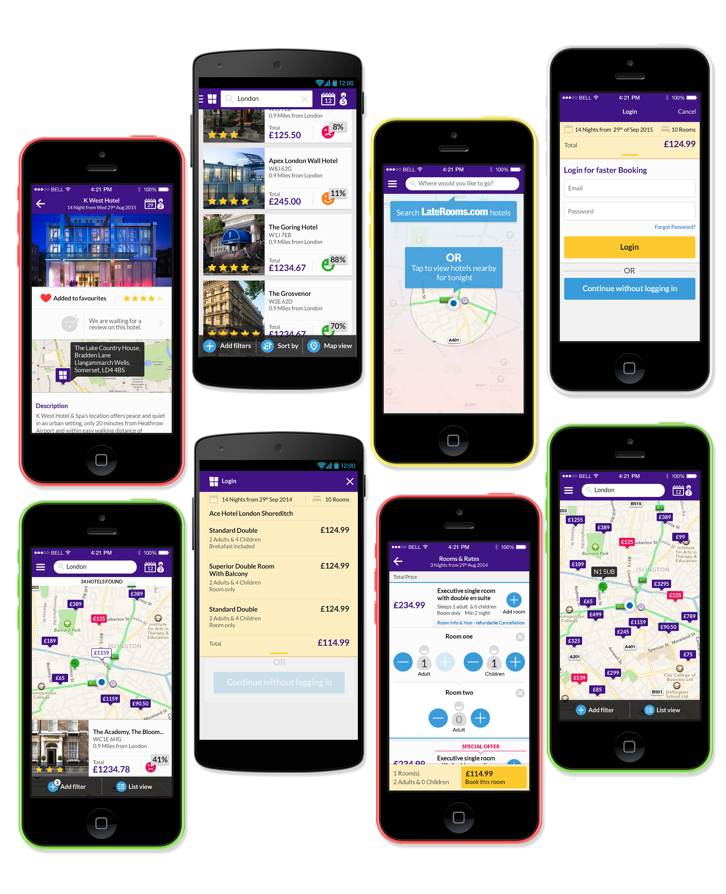

| Expertise            | Platforms     | Output            |
| -------------------- | ------------- | ----------------- |
| Design & Interaction | iOS & Android | UI, UX & Strategy |

###The problem

LateRooms is a hotel booking service. At the time they had a strong presence online but a weak mobile experience. Ustwo rebuilt the app from the ground up. Working as the lead product designer I was tasked with redesigning the app for both iOS and Android. From the pitch to product delivery cycle I was responsible for the visual look and feel, user experience and product strategy.

###Redefining the brand for mobile

Even though Laterooms had an existing brand it needed some help and guidance to move them towards a modern experience. I created a series of workshops to work out the new visual brand and how it would translate to mobile.
[For a more in-depth understanding of the process read this](https://www.creativebloq.com/app-design/design-studio-gives-mobile-booking-app-super-powers-21410594)
  

###Creating a playful product

One of the traits that LateRooms wanted was a product that had a level of playfulness in its personality. So working with the talented [Ben Marsh](http://www.ben-marsh.com/) we looked into how we could add this to the visual language. We created some moments of delight the icons had a playful tone and we had some rich animations/transitions.
  

###Redesign for Asia

LateRooms owned another brand called AsiaRooms (which has now merged into LateRooms). We were tasked with reworking the product for the Asian market.
  

###Improving the process

Whilst at ustwo we always looked at the process and how we could improve it. Working with the coach we looked at how we can bring design closer to development within agile. This diagram explains it.
  

###Final product

##Outcome
We had great success in improving the app, taking it from 1-star reviews to a class-leading experience. The design language we created for the app rolled out onto all touch points from the website to above the line advertising.
