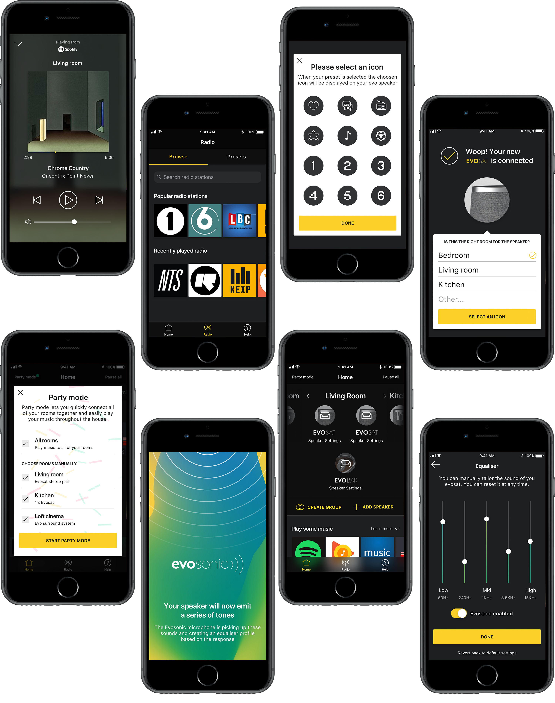

| Expertise                        | Platforms     | Deliverables      |
| -------------------------------- | ------------- | ----------------- |
| Design, Interaction & Lean/Agile | iOS & Android | UI, UX & Strategy |

###The Problem

[Cambridge Audio](https://www.cambridgeaudio.com/gbr/en) came to [Potato]() to help them design an iOS and Android application for a new multi-room speaker range - The Evo system. They also wanted to learn product development and lean UX.

###The Approach

We created a plan that worked with budget and their internal development plan.
1 week of lean research > the following week was validation sprint with the client after that we moved into a design phase.
  

##Building the right thing

Working with senior members of the Cambridge Audio team we looked to gain a shared understanding of the problem and the users. During the first day we started with an empathy map to get under the skin of the segments. After that we then used the Roman Pincher product vision board and created one for the Evo system.
  
We spent the following day gathering all the assumptions we believed the product is/does/feels/looks like and mapped them on the assumption matrix. We focused on the riskiest and the highest priority assumptions. Using these assumptions we then created hypothesis that we wanted to test.
  

###Sketching

The following day we moved into a sketching, Taking inspiration from the “Google Design Sprint” we held a morning of sketching sessions based on the assumptions and hypothesis. Starting with crazy eight’s those ideas then influenced “Solution creation” from that we then created a storyboard of the prototype. Whilst we created the storyboard we mapped all the hypothesis that we created in the previous day - this made sure that we had the right tests we wanted to validate.
  

###Prototype

Our next focus was to create a prototype to validate with users if our hypothesis are correct or not. (To do create a prototype). As some of our hypothesis could not be tested in the prototype we ran another survey to validate these assumptions.
  

###Lean Testing

We ran user testing session at the end of the week to validate our Hypotheiss. As we had a relative small budget we wanted to focus on creating minimal deliverables so we stored all the recommendations on a Trello board which run though with the client.  
  

##Design, ~~build,~~ test

The second stage of the work was to create the product that would be built. Unfortunately this project had to be ran waterfall :shower: as the in-house development team would not be ready to build this.
  
We had morning stand-ups and a weekly review to make sure their was alignment but this would never be the same as an Agile/Scrum software development. :thumbsdown:

###Design decisions

1. The app should be a supporting experience most of the time people will control via their preference music player

2. Set-up should be timely and get them to the music as soon as possible

3. Calibration should be simple and quick - reduce steps as much as possible

###Mapping the product
Taking all the information from the testing the first step was to map out the whole product and to understand what would be the MVP could be. We used the story mapping technique and created all tasks the user would need to do.
  

  

Using the story mapping information we then created an app to understand all the user journeys.
  

###Design system
Working closely with the visual designer Taavet Kelle my role in this part was to lead and guide the visual language. Taavet created a system for both the iOS and Android we decided to create a visual language that felt natural within each platform utilise interaction models and visual language of the platform (type, shadows etc).
  

###The end product
(This is what we hope it to look like)
  

##Outcomes

> "Thanks a lot, it was such a valuable month for us, (and me personally) The whole lean approach is the biggest goal for me and we’re slowly getting everyone thinking that way. You were all a great help in reinforcing that"  **-Chris Saunders Product Manager for Cambrdige Audio**

As the product has not been released I don’t have data on the success of the product.

<!-- ###Learning
Unfortunately this product was waterfall which goes against my belief that the best products are made into multi-discipline teams.

When doing workshops with clients that don’t understand Lean UX it would be good to spend time outlining the process. -->
