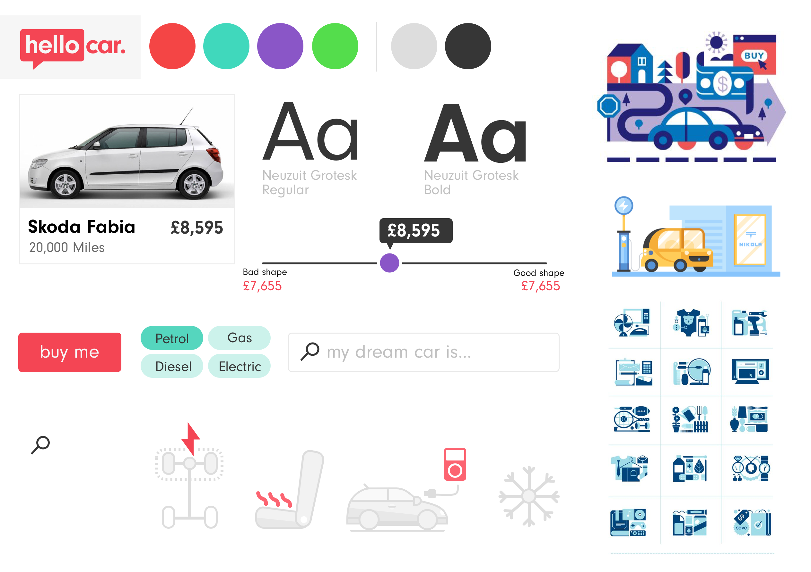
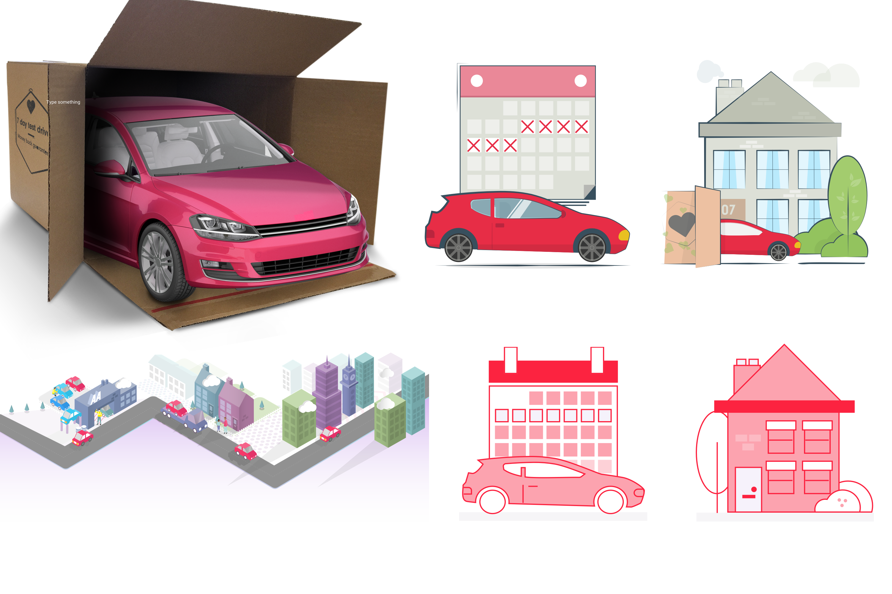
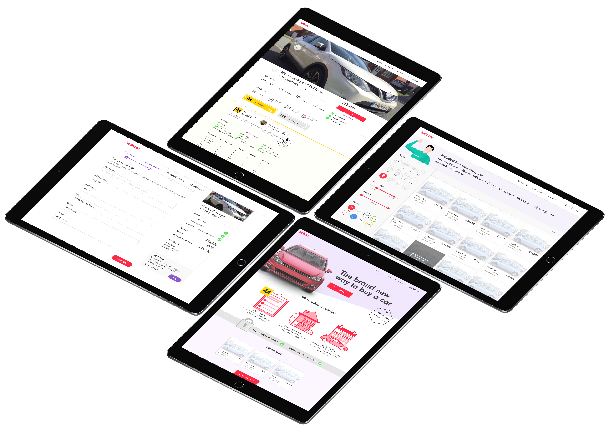
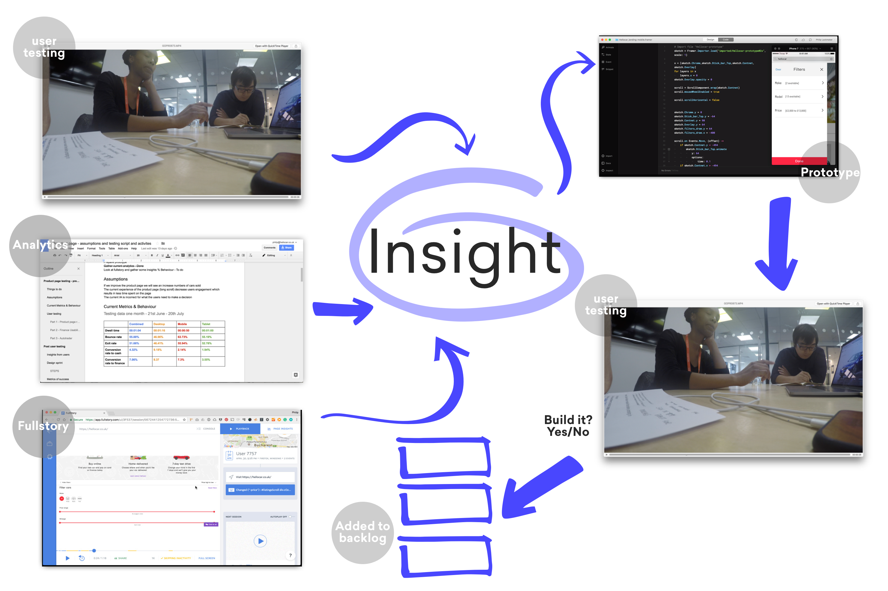
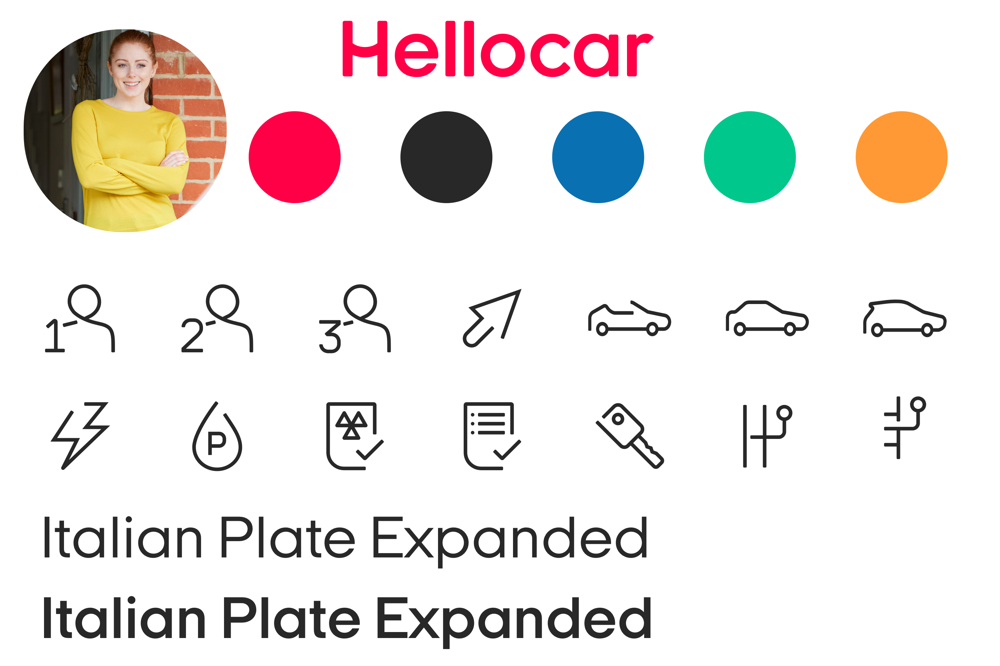
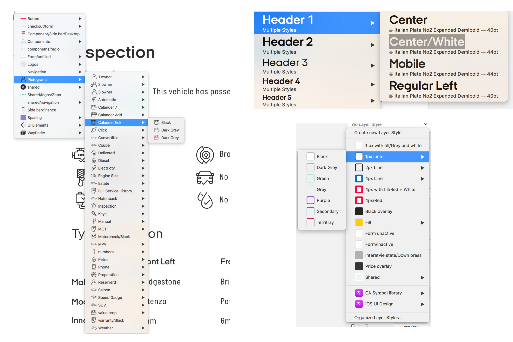
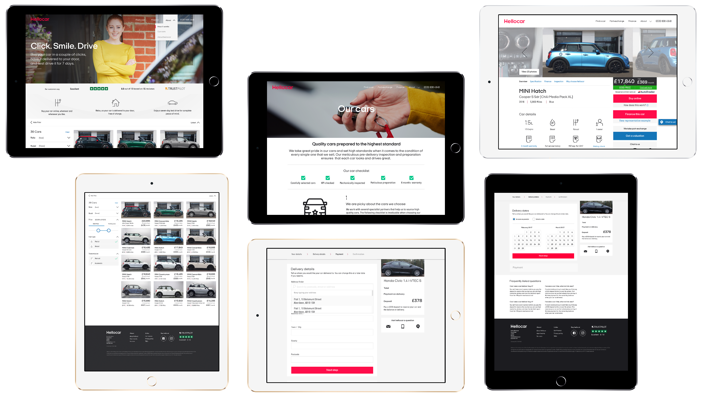

| Expertise                         | Platforms      | Deliverables |
| --------------------------------- | -------------- | ------------ |
| Design, Interaction & Prototyping | Responsive Web | UI & UX      |

###The Problem

[Founders Factory](https://foundersfactory.com/) identified a business model that they could replicate in the UK market. The model was to create a market place to buy and sell used cars. They wanted to replicate other successful business such as [Beepi](https://techcrunch.com/2016/12/07/used-car-marketplace-beepi-shuts-down-outside-of-ca-merges-with-stealth-fair-com/) (this went bust 3 months int🤨) and also [Carspring](https://techcrunch.com/2017/10/10/rocket-carspring/) (F\*%K this also went bust…is it a sign). They raised a load of money from some big players in the start-up world.

##Getting the MVP out there

When I joined there was a goal by the business to get MVP out as quick as possible this pressure came from investors wanting to see R.O.I. Founders Factory created a proof of concept but this was more smoke and mirrors than an actual product. Taking the great work Founders Facotry I created a product for real users.
[ ] Illustration of time frame and dates

###Brand and positioning

One of my tasks was to create a brand for the service. I was well aware that we were going to work with a branding agency to create a new brand, with that in mind I created a lean brand (I spent an afternoon on it) so we had something to build the product with.
  
In hindsight (I might be saying this work a few times) this might not of put us in the best postion for success. Hellocar is different to a S.A.S.S product buying a car is one of the biggest purchases you going to make and if you going to make this online without seeing the car you need to have trust in the brand.
  

###Landing page v1

This was one of the hardest pages to design; no assets, no imagery, no positioning and no value prop.
  
My desire was to move away from the standard start-up landing page in hindsight this may of made the task harder. As boring as the pattern is it does works because users are familiar that hierarchy and layout of information. We are asking users to do something they have never done before (buying a car online that they have not seen or touched) should we also challenge them with a progressive visual language.

I tried multiple ways of explain the model and the value including putting a 3D car in a box 😜(F.Y.I this was not my idea)
    

###MVP

**"If You're Not Embarrassed By The First Version Of Your Product, You’ve Launched Too Late"**

##Beyond the MVP
###Design process

Deciding what we would build next ultimately was controlled by the head of product my role was to give him the right information to make an informed decision.
  
This data would come from multiple sources; user testing sessions, Fullstory, and analytics. In hindsight we should of made the majority of a decisions on analytics, qualitative came over quantitive data.
   

###Getting the experts

The current brand was created by me and it was too cute to reassure a customer to purchase a £10,000 car online. We worked with the brillant Nomad who helped to elevate the brand to something people believed in. I took what they create and moved it into a digital system. Unfortunately this may of been too little to late.
   

###Design system

Taking the work that nomad created I geeked out on sketch and created a symbol system so that anyone who designed a feature for the product had all the building blocks to make a feature.
   

###Final product

