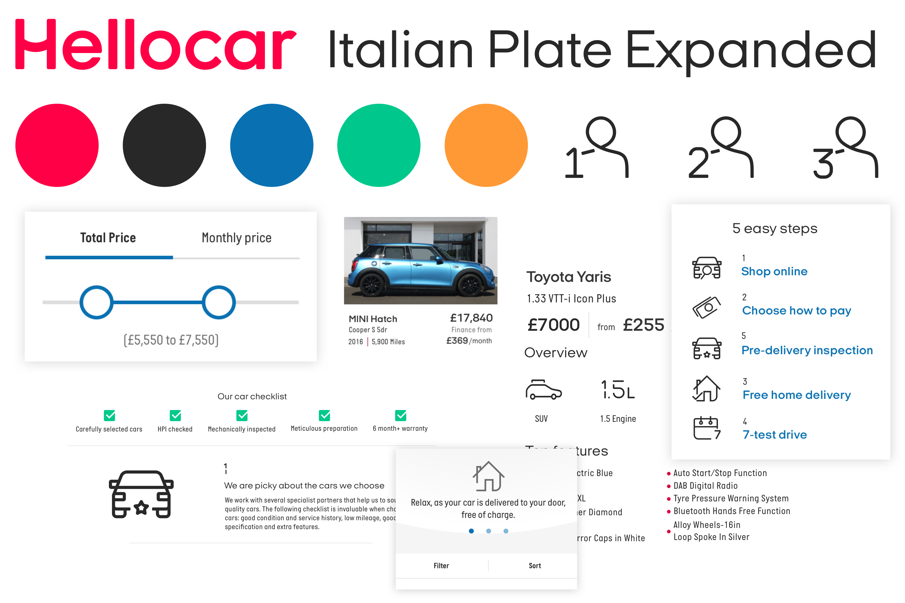
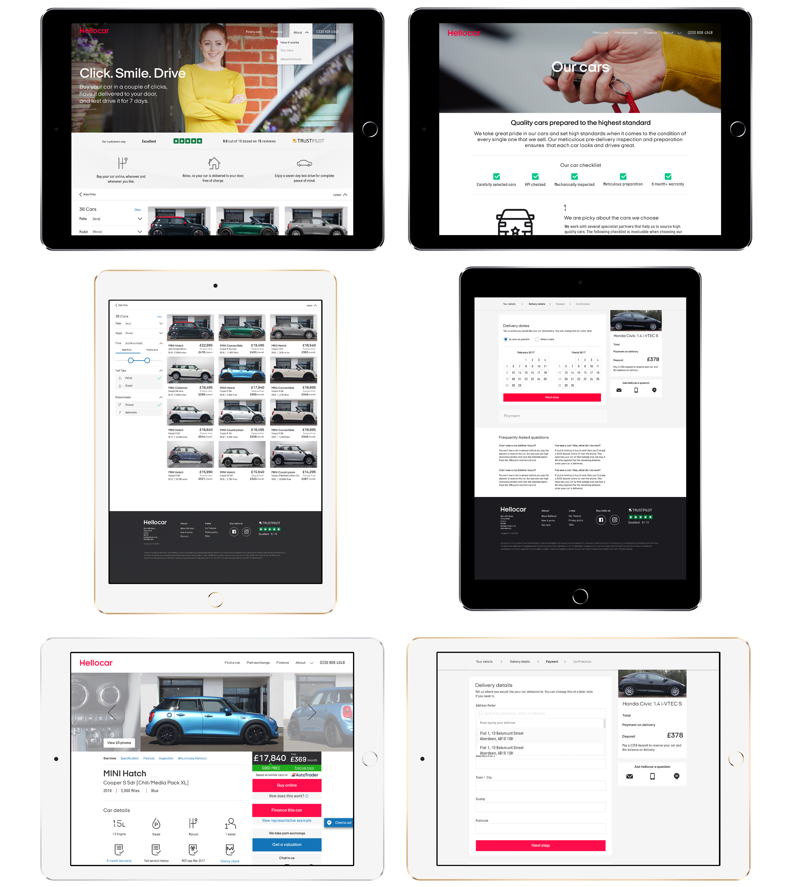
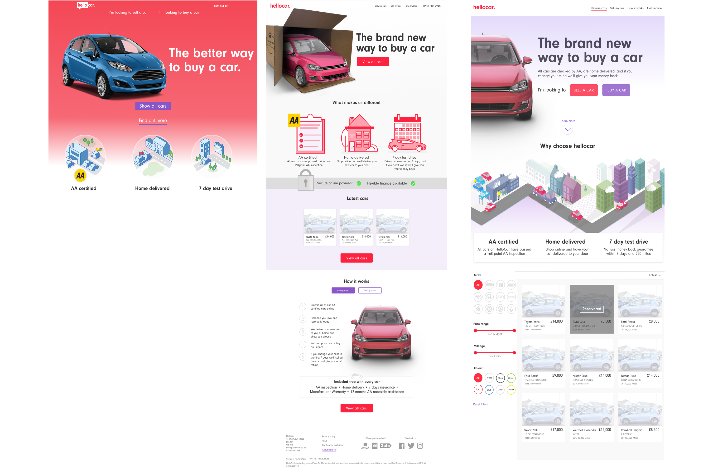

| Expertise                         | Platforms      | Output  |
| --------------------------------- | -------------- | ------- |
| Design, Interaction & Prototyping | Responsive Web | UI & UX |

###The Problem

[Founders Factory](https://foundersfactory.com/) identified a business model that they could try to replicate in the UK market. The model was to create a marketplace to buy and sell used cars.
  
When I joined there was a goal by the business to get an MVP to market as quick as possible. The pressure came from investors wanting to see R.O.I. [They had raised lots of money from some big players in the UK start-up scene.](https://techcrunch.com/2017/02/11/uks-hellocar-secures-1m-to-to-disrupt-uk-car-buying-market/?guccounter=1) There was a proof of concept but this was more smoke and mirrors to raise money than an actual product. Taking that as the foundation I created a product for real customers that was validated by users.
  
###Creating the MVP
Working with an aggressive time frame we launched an end to end experience which allowed people to buy cars online. It was not pretty or perfect but it allowed us to start testing the business model.
 
_"If You're Not Embarrassed By The First Version Of Your Product, You’ve Launched Too Late"_

##Beyond the MVP
###Design process

We made decisions on what to build next by gathering data. This data would come from multiple sources; user testing sessions and analytic tools. I would take a lead on gathering this data and then relaying it to the business.
  
We would review analytics daily finding how features performed. Every two weeks we would run user testing sessions, they would be a mix of ethnographic and usability research.
  

###Visual design system

We worked with the brilliant [Nomad](http://www.nomadstudio.com/) who helped to elevate the brand to something people trusted. Taking what they created I then moved it into a scalable digital system.
  

###Sketch design system

Using Nomad's design system I created a detailed library within Sketch. This consisted of a symbol system and type & colour library. This allowed anyone who designed for the product to have all the building blocks to create a feature.
  

###Final product

##Outcome

We created a product from scratch and built it into a service where you could buy a car online. Unfortunely we did not find product market fit [I wrote a short piece about why this might of happened.](/why-did-hellocar-fail)

<!-- ###Brand and positioning

One of my tasks was to create a brand for the service. I was well aware that we were going to work with a branding agency to create a new brand, with that in mind I created a lean brand (I spent an afternoon on it) so we had something to build the product with.
  
In hindsight, this might not have put us in the best position for success. Hello car is different to an S.A.S.S product, buying a car is one of the biggest purchases you going to make and if you going to make this online without seeing the car you need to have trust in the brand.
  
 -->

<!-- ###Landing page v1

This was one of the hardest pages to design; no assets, no imagery, no positioning and no value proposition.
  
My desire was to move away from the standard start-up landing page in hindsight this may have made the task harder. As boring as the pattern is it does works because users are familiar that hierarchy and layout of information. We are asking users to do something they have never done before (buying a car online that they have not seen or touched) should we also challenge them with a progressive visual language.
   -->

<!-- I tried multiple ways of explaining the model and the value including putting a 3D car in a box 😜. -->

  

<!--  -->
<!--
 -->
<!--
###MVP -->

<!-- Deciding what we would build next ultimately was controlled by the head of product. My role was to give him the right information to make an informed decision.
  
This data would come from multiple sources; user testing sessions and analytic tools. In hindsight, we should have made the majority of decisions on analytics. Qualitative data came over quantitive data. -->
